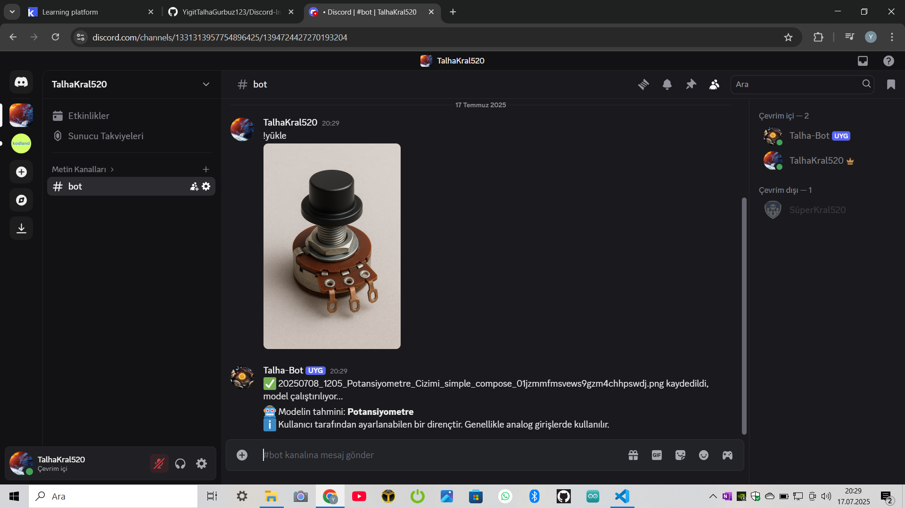
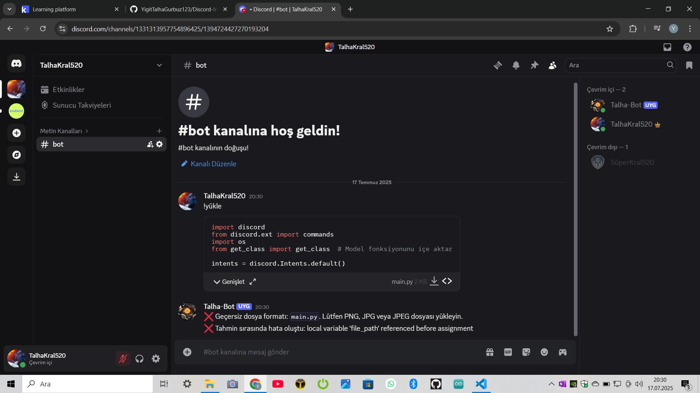
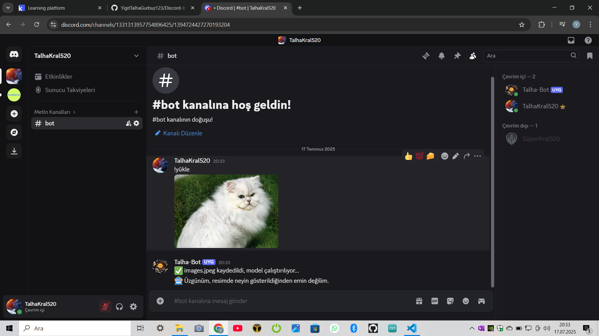

Discord Discord-Image-Classification-Bot!

## Botun özellikleri:

--Discord botu olarak çalışır

--Devreler hakkında bir .h5 dosyasını eğitilmiş makine olarak kullanır

--Bu proje sizin devreleri anlamanız hakkında yardımcı olur

--Bot dosyadaki arızaları; örneğin yanlış tür, alakasız dosya vs algılayacak!

## Kullanım için gereken kütüphaneler ve sürümler:

--python 3.10 gerekir yoksa çalışmaz

--pip install discord

--pip install tensorflow==2.14.0

--pip install keras==2.14.0

--pip install requests

--pip install numpy==1.24.3

--pip install Pillow

## Kullanım için gereken önemli not!

--Bu botu kullanmak için bir vpn gerekir çünkü discord Türkiye'de kapalı. Sakın virüslü vpn indirmeyin!

## Discord Botu Oluşturma ve Ayarlama

1. **Discord Developer Portal’a girin:**  
   [https://discord.com/developers/applications](https://discord.com/developers/applications)

2. **Yeni bir uygulama oluşturun:**  
   Sağ üstte "New Application" butonuna tıklayın, botunuza bir isim verin ve oluşturun.

3. **Botu ekleyin:**  
   Sol menüden "Bot" sekmesine gelin, "Add Bot" butonuna tıklayın ve onaylayın.

4. **Token’ı alın:**  
   Bot sekmesinde "Token" kısmından "Copy" ile bot tokenınızı alın. Bu token, botunuzun Discord’a bağlanması için gereklidir, gizli tutun!

5. **İzinleri ayarlayın:**  
   Botunuzun hangi izinlere ihtiyacı varsa (mesajları okuyup göndermek, dosya almak vb.), "OAuth2" > "URL Generator" kısmında izinleri seçin.

6. **Botu sunucuya davet edin:**  
   Aynı "URL Generator" sayfasında oluşturulan URL’yi kopyalayıp tarayıcıda açın, botu istediğiniz Discord sunucusuna ekleyin.

7. **Token ayarları:**
   Bu tokeni main.py içindeki token yerine yazın ve Vpn yi açıp projeyi başlatın!

8. **Yazı:**
   Botu çalıştırmak için bota !yükle yazın ve eklerden fotoğrafı atıp deneyin!

9. **Sonuuç:**
   Bot bunun ne olduğu hakkında size cevap verecek!

## Bot ile ilgili görseller:

**Bot Çalışırken:**

**Yanlış dosya algılama**

**Alakasız şey algılama**

## License
This project is licensed under the GNU General Public License v3.0 - see the [LICENSE](LICENSE) file for details.

